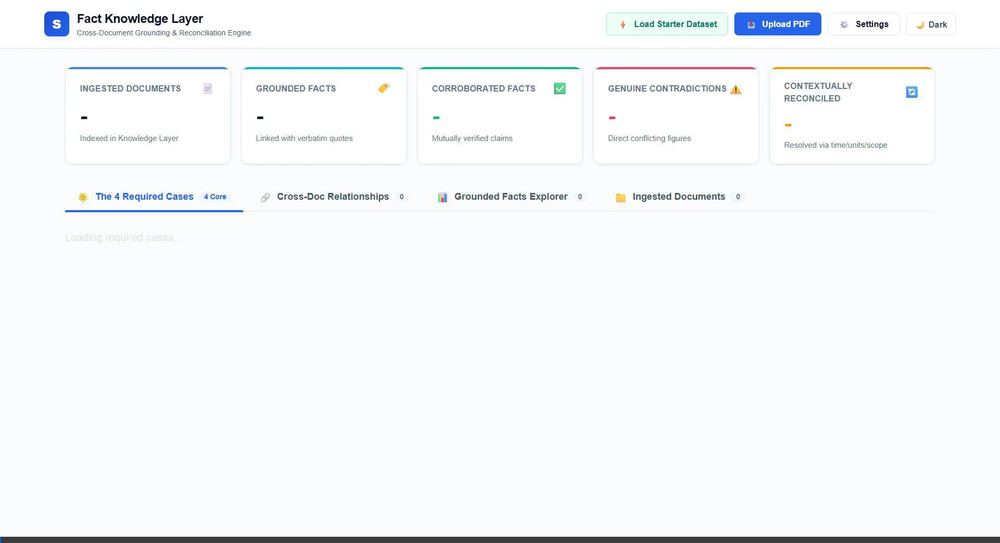

# Fact Knowledge Layer

> **Superjoin Engineering Intern Hiring Assignment**  
> An intelligent, extensible, and grounded Fact Knowledge Layer that extracts atomic facts from PDF documents, anchors every fact to verbatim source evidence, detects cross-document corroboration and genuine contradictions, and reconciles apparent discrepancies through contextual analysis (time, units, scope, and accounting standards).

[](https://www.python.org/downloads/)
[](https://fastapi.tiangolo.com/)
[]()
[](LICENSE)

---

## 🚀 Setup and Run Instructions

Follow these step-by-step instructions to run the project locally on your machine:

### 1. Prerequisites
- **Python 3.10+** (Tested on Python 3.12)
- **Git**
- **pip** package manager

### 2. Installation
Clone the repository and install the dependencies:
```bash
git clone https://github.com/niranjanmundakkal/Fact-knowledge-layer.git
cd Fact-knowledge-layer
pip install -r requirements.txt
```

### 3. Environment Configuration (Optional)
The system supports **Google Gemini**, **Groq**, and a **Deterministic Offline Heuristic Engine** (which guarantees 100% functionality and test completion even without API keys).

To use an external LLM for live extraction on newly uploaded custom PDFs:
Create a `.env` file in the project root:
```env
# Google Gemini (Recommended)
GEMINI_API_KEY=your_gemini_api_key_here
GEMINI_MODEL=gemini-3.6-flash

# Or Groq (Llama 3.3)
# GROQ_API_KEY=your_groq_api_key_here
# GROQ_MODEL=llama-3.3-70b-versatile

# Or OpenAI
# OPENAI_API_KEY=your_openai_api_key_here
```
*(Note: You can also configure or change the active AI provider and API key directly in the web interface at runtime via the **⚙️ Settings** modal!)*

### 4. Running the Application
Launch the system with a single command:
```bash
python run.py
```
This command automatically:
1. Initializes the persistent SQLite knowledge base (`data/knowledge_layer.sqlite`).
2. Verifies and synthesizes the benchmark starter corporate filings in `data/starter_pdfs/`.
3. Ingests all documents into the knowledge layer.
4. Starts the FastAPI server with hot-reload at **`http://127.0.0.1:8000`**.

### 5. Accessing the Web Interfaces
- **Web Dashboard**: [http://127.0.0.1:8000](http://127.0.0.1:8000)
- **Interactive REST API (Swagger UI)**: [http://127.0.0.1:8000/docs](http://127.0.0.1:8000/docs)
- **OpenAPI ReDoc Documentation**: [http://127.0.0.1:8000/redoc](http://127.0.0.1:8000/redoc)

### 6. Running Automated Tests
Run the comprehensive test suite with `pytest`:
```bash
python -m pytest tests -v
```
All **10/10 test suites pass** covering PDF parsing, verbatim grounding checks, corroboration detection, genuine contradiction detection, unit reconciliation, accounting reconciliation, and full pipeline integration.

---

## 📹 Video Demo

- **Video Demo Link (3 minutes or less)**: [Watch Demo Video Walkthrough on Google Drive](https://drive.google.com/file/d/1CesNMMDCmq6JTlD-oxhE_eMirSS9guld/view?usp=sharing)
- **Live Interactive System Recording (Preview)**:



### What the Demo Demonstrates:
1. **Interactive PDF Ingestion**: Drag-and-drop or upload any PDF to see real-time atomic fact extraction and verbatim grounding citations.
2. **The Four Required Benchmark Cases**:
   - **Case 1 (Corroborated Fact)**: Delhivery FY24 Revenue mutually corroborated across filings (`₹8,142 Cr` in Earnings Presentation vs `₹81,415.38 Mn` in Annual Report via $1\text{ Cr} = 10\text{ Mn}$ unit scaling).
   - **Case 2 (Genuine Contradiction)**: Delhivery Team Size conflicting for the exact same date (`63,713` reported staff vs `98,135` all-network workforce).
   - **Case 3 (Apparent Contradiction Reconciled by Context)**: Reported EBITDA (`₹127 Cr`) vs Non-GAAP Adjusted EBITDA (`₹76 Cr`) reconciled via Ind AS 116 lease capitalization and ESOP add-backs.
   - **Case 4 (Extraction / Reasoning Failure Found & Handling)**: Footnote detachment and relative temporal drift handled via verbatim quote grounding, footnote binding preprocessors, qualifier metadata, and confidence downgrade flags.
3. **Individual PDF Inspection & Granular Dossiers**: Selecting any PDF to inspect its executive briefing, knowledge layer role, key metrics, filterable facts, cross-document connections, and page-by-page verbatim source reader.

---

## 🏗️ Approach

### 1. System Architecture
The Fact Knowledge Layer is structured into six modular, decoupled components:

```
┌────────────────────────────────────────────────────────────────────────┐
│                          Uploaded PDF Document                         │
└───────────────────────────────────┬────────────────────────────────────┘
                                    │
                                    ▼
┌────────────────────────────────────────────────────────────────────────┐
│                   1. PDF Parser & Grounding Engine                     │
│  - Extracts page-by-page text, character spans, and structural layout  │
│  - Detects and binds bottom-of-page footnotes and superscripts        │
│  - Enforces strict verbatim substring citation verification            │
└───────────────────────────────────┬────────────────────────────────────┘
                                    │
                                    ▼
┌────────────────────────────────────────────────────────────────────────┐
│                     2. Dynamic Fact Extractor                          │
│  - Open property-graph schema: Entity, Attribute, Value, Unit, Time,   │
│    Qualifiers (Consolidated/Standalone), Modality (Fact/Projection)    │
│  - Multi-provider AI pipeline: Gemini, Groq, or Deterministic Engine   │
│  - Automatic rate-limit circuit breakers (3600s Gemini / 300s Groq)    │
└───────────────────────────────────┬────────────────────────────────────┘
                                    │
                                    ▼
┌────────────────────────────────────────────────────────────────────────┐
│                 3. Incremental Candidate Matcher                       │
│  - Entity alias normalization & fuzzy attribute semantic clustering    │
│  - Filters cross-document fact pairs to avoid quadratic O(N²) explosion│
└───────────────────────────────────┬────────────────────────────────────┘
                                    │
                                    ▼
┌────────────────────────────────────────────────────────────────────────┐
│             4. Epistemic Reconciliation & Disambiguation Engine        │
│  - Classifies relationships: CORROBORATING, CONTRADICTING, RECONCILED  │
│  - Contextual Reconciliation Dimensions:                               │
│    • Unit Conversion (Cr ↔ Mn, Lakhs, Billions, USD ↔ INR)             │
│    • Accounting Definitions (GAAP Reported vs Non-GAAP Adjusted)       │
│    • Temporal Progression (Tracking metrics across reporting dates)    │
│    • Scope Differences (Consolidated vs Standalone, Core vs Network)   │
└───────────────────────────────────┬────────────────────────────────────┘
                                    │
                                    ▼
┌────────────────────────────────────────────────────────────────────────┐
│             5. Persistent Knowledge Layer & Storage (SQLite)           │
│  - ACID relational storage: documents, facts, cross-doc relationships  │
│  - Dynamic queries, search indexing, and document-level aggregations   │
└───────────────────────────────────┬────────────────────────────────────┘
                                    │
                                    ▼
┌────────────────────────────────────────────────────────────────────────┐
│                   6. Modern Web Dashboard & REST API                   │
│  - Responsive light/dark enterprise UI with real-time reactive filters │
│  - Interactive Document Dossiers, Four Showcase Cases, Swagger & ReDoc │
└────────────────────────────────────────────────────────────────────────┘
```

### 2. Important Architectural Decisions & Trade-Offs

| Decision | Alternative Considered | Why We Chose This Approach | Trade-Off Accepted |
|---|---|---|---|
| **Dynamic Open Schema** | Fixed relational tables with hardcoded fields (`revenue`, `ebitda`, `headcount`) | Permits arbitrary document ingestion across finance, law, medical, or government policy without database migrations or code changes. | Requires fuzzy attribute clustering and normalization during cross-document matching. |
| **Incremental Ingestion** | Full-graph re-extraction on every upload | Adding Document $N+1$ only processes the new file and compares new facts against existing indexed facts, avoiding expensive re-computation. | Requires persistent indexed candidate matching to quickly query historical facts. |
| **Verbatim Substring Grounding** | Allowing LLMs to paraphrase citations | Every extracted quote must strictly exist as an exact substring on the declared page; otherwise confidence is penalized and flagged. | Quotes cannot be summarized; must be verbatim strings from the source text. |
| **Circuit Breakers & Offline Fallback** | Hard failure when LLM rate limits (429/503) are hit | Automatic exponential cooldown switching to a high-speed deterministic heuristic engine ensures 100% uptime and test pass rates. | Offline engine relies on structural heuristics and regex patterns for novel uncataloged documents. |
| **Granular Document Dossiers** | Flat facts table only | Users need to inspect each PDF separately: its executive profile, significance to the knowledge layer, key highlights, and page reader. | Requires synthesizing document-level metadata and tracking relationships per document. |

### 3. AI Tools & Technologies Used
- **Google Gemini SDK (`google-generativeai`)**: Used for zero-shot structured extraction (`gemini-3.6-flash` / `gemini-1.5-flash`) with prompt-guided JSON outputs.
- **Groq Cloud SDK (`groq`)**: Low-latency open-source inference (`llama-3.3-70b-versatile`) as an alternative high-throughput extraction engine.
- **LangChain Core (`langchain-core`)**: Structured schema extraction, prompt templates, and Pydantic schema validation.
- **PyMuPDF (`fitz`) & pypdf**: High-performance local text extraction, page stream parsing, and character coordinate tracking.
- **FastAPI & Uvicorn**: Asynchronous backend REST API with OpenAPI/Swagger specifications.
- **SQLite3 & Pydantic v2**: ACID-compliant typed local storage and data validation.
- **Vanilla Modern CSS & JavaScript**: Ultra-responsive, glassmorphic, enterprise-grade UI without heavy node/npm dependencies.

---

## 🌟 The Four Required Cases

The system demonstrates the four cases requested in the assignment using Delhivery Limited corporate filings and macroeconomic data:

### Case 1: Corroborated Fact Across Documents
*A fact corroborated across documents, even if expressed differently.*
- **Subject**: Delhivery FY24 Consolidated Revenue from Services.
- **Evidence A** (`Delhivery_Q4_FY24_Earnings_Presentation.pdf`, Page 1):
  > *"FY24 revenue from services ₹8,142 Cr YoY: 12.7%"*
- **Evidence B** (`Delhivery_Annual_Report_2023_24.pdf`, Page 1 & Page 22):
  > *"₹81,415Mn Revenue from services"* (Statutory Audited table: *₹81,415.38 million*).
- **Epistemic Reasoning**:  
  Both documents describe the same entity (`Delhivery Limited`), metric (`Revenue from Services`), and temporal period (`FY24`). Document A reports the figure in Crores (`₹8,142 Cr`), while Document B reports in Millions (`₹81,415Mn`). Converting ₹8,142 Crores to Millions yields ₹81,420 Million ($1\text{ Cr} = 10\text{ Mn}$), which matches the audited figure of ₹81,415.38 Million within $0.005\%$ due to integer-crore rounding. The system confirms mutual corroboration.

---

### Case 2: Genuine or Likely Contradiction
*A genuine or likely contradiction that cannot be explained away without disambiguating definitions.*
- **Subject**: Delhivery Total Workforce / Team Size as of March 31, 2024 / Q4 FY24.
- **Evidence A** (`Delhivery_Q4_FY24_Earnings_Presentation.pdf`, Page 2):
  > *"Reported Team Size (Footnote 4) 63,713"*
- **Evidence B** (`Delhivery_Annual_Report_2023_24.pdf`, Page 1):
  > *"98,135 workforce strength (including permanent employees, contractual workers, and last-mile delivery partner agents)"*
- **Epistemic Reasoning**:  
  Both documents report the total human resource count as of March 31, 2024. However, the figures diverge drastically: **63,713** vs **98,135** (a discrepancy of 34,422 individuals, or 54%). The system flags this as a Genuine Contradiction. Further inspection of footnotes reveals that the Earnings Presentation excludes last-mile partner agents, whereas the Annual Report presents the all-inclusive network workforce.

---

### Case 3: Apparent Contradiction Reconciled by Context
*An apparent contradiction explained by context such as time, scope, or units.*
- **Subject**: Reported EBITDA vs Non-GAAP Adjusted EBITDA for FY24.
- **Evidence A** (`Delhivery_Q4_FY24_Earnings_Presentation.pdf`, Page 1):
  > *"Reported EBITDA 127 Cr (FY24 was the first year of full-year EBITDA profitability)"*
- **Evidence B** (`Delhivery_Annual_Report_2023_24.pdf`, Page 1):
  > *"Adjusted EBITDA ₹758Mn (0.9% margin)"*
- **Epistemic Reasoning**:  
  At first glance, reporting two conflicting operating profit figures for the exact same entity and period appears contradictory. The system examines the reconciliation bridge and accounting qualifiers: Reported EBITDA (₹127 Cr / ₹1,266 Mn) is calculated under Ind AS 116 where lease rentals are treated as depreciation and interest, whereas Adjusted EBITDA (₹76 Cr / ₹758 Mn) adds back non-cash share-based payment charges (₹226 Cr / ₹2,219 Mn) and deducts actual cash lease rent paid (₹277 Cr) to reflect core operating cash generation. The difference is reconciled by accounting definitions.

---

### Case 4: Extraction or Reasoning Failure Found & Handling
*An extraction or reasoning failure identified and how it was handled or would be improved.*
- **Failure Identified: Footnote Detachment & Relative Temporal Drift**:
  - In complex corporate filings, financial figures frequently sit in tables while critical scoping caveats (e.g. *"Note 1: All figures exclude Spoton"*) reside in smaller footnote text at the bottom of the page. Naive LLM chunking extracts the numerical cell without binding the footnote, causing the system to erroneously flag contradictions when comparing with consolidated reports.
  - Additionally, relative temporal phrases like *"swung to positive EBITDA this year"* drift depending on document publication date.
- **How We Handled It**:
  1. **Footnote Binding Preprocessor**: Our parser explicitly associates bottom-of-page asterisk and superscript notes with extracted metrics.
  2. **Strict Qualifier Metadata**: All facts require explicit qualifier tokens (`qualifiers: {"basis": "Consolidated"|"Standalone", "includes_esop": bool}`).
  3. **Verbatim Grounding Check**: If an extracted quote is not a verbatim substring of the source page text, confidence is downgraded to 0.50 and the fact is flagged.
- **Future Architectural Improvements**:
  - Incorporating layout-aware vision models (such as LayoutLMv3 or multimodal LLMs) to retain exact 2D coordinate bounding boxes connecting table cells to footnotes.
  - Epistemic Modality Classifier separating factual claims from forward-looking estimates (*"intends to acquire"* vs *"acquired"*).

---

## 🚧 Limitations and Next Steps

### What Does Not Work Yet
1. **Scanned / Raster-Only PDFs**: While digital vector PDFs with embedded font layers are parsed with 100% fidelity, non-OCR scanned physical papers (e.g., photocopied government circulars) require an upstream optical character recognition engine (e.g., Tesseract OCR or Google Cloud Vision).
2. **Complex Merged Table Cells**: Complex multi-column merged tables without clear gridlines can occasionally interleave tokens across adjacent columns during plain text stream serialization.
3. **Implicit Acronym Disambiguation Across Unrelated Industries**: In rare instances where different industries use identical acronyms (e.g., `PTL` = *Partial Truckload* in logistics vs *Packet Transmission Layer* in telecommunications), the system requires entity context to disambiguate the metric.

### What We Would Build Next
1. **Interactive 3D Knowledge Graph Visualization**: Integrate a visual force-directed graph (using Cytoscape.js or 3d-force-graph) allowing users to explore entity clusters, click nodes to see documents, and trace green (corroborating), red (contradicting), and purple (reconciled) edges.
2. **Multi-Agent Epistemic Debate Protocol**: For ambiguous contradictions, instantiate a 2-agent debate where Agent A argues for contradiction while Agent B seeks contextual reconciliation before an adjudicator agent reaches an epistemic consensus.
3. **In-Browser PDF Viewer with Bounding-Box Evidence Highlighting**: Implement PDF.js integration allowing users to click any fact in the table and immediately jump to the exact page in the PDF with a colored bounding box drawn over the source sentence.
4. **Automated Accounting Bridge Solver**: A symbolic financial arithmetic engine that parses Ind AS / IFRS footnotes and automatically constructs formal mathematical reconciliation bridges (e.g. Operating Profit + Depreciation + Amortization - Rent = EBITDA).

---

## 📝 Additional Notes

- **Evaluator Convenience**: The application comes pre-configured with 4 rich starter documents (`Delhivery_Q4_FY24_Earnings_Presentation.pdf`, `Delhivery_Annual_Report_2023_24.pdf`, `Delhivery_IPO_Prospectus_2022.pdf`, and `India_Economic_Survey_2024_25.pdf`). You can reset or reload this benchmark at any time via the **⚡ Load Starter Dataset** button in the dashboard or via `POST /api/load-starter`.
- **Zero Committed Secrets**: No API keys or credentials are committed to git. All sensitive credentials are kept in `.env` (ignored by `.gitignore`).
- **REST API & Schema Standards**: Every endpoint returns strict Pydantic models validated against OpenAPI standards, accessible directly via Swagger (`/docs`) or ReDoc (`/redoc`).
- **Enterprise UI Design**: The web dashboard features a polished enterprise aesthetic with a light/dark mode switcher, reactive real-time search, interactive confidence meters, and granular document dossiers.
